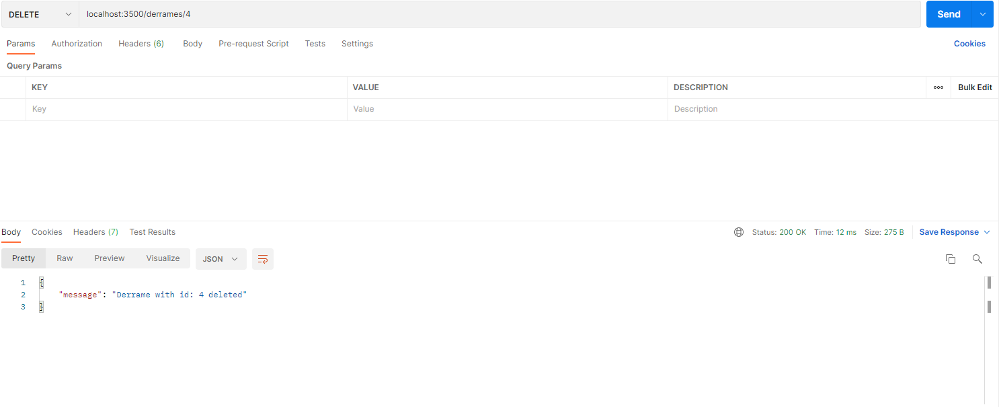
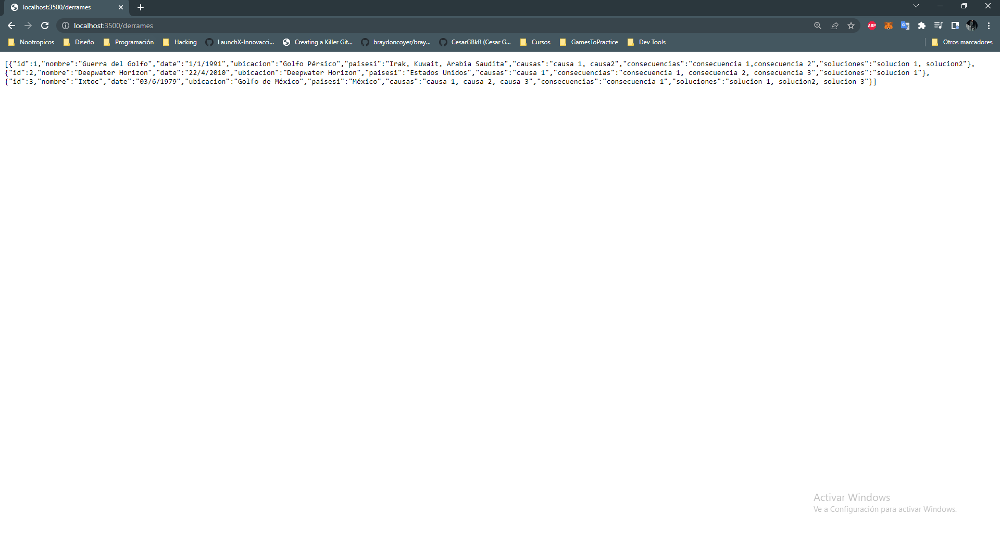
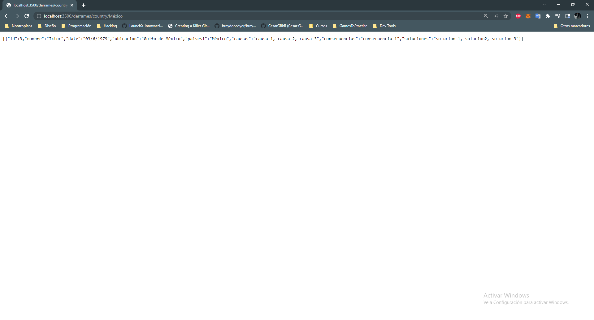
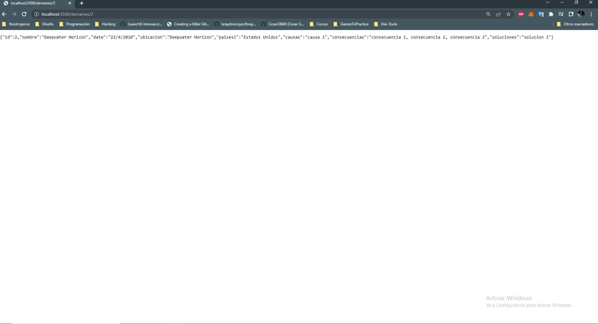
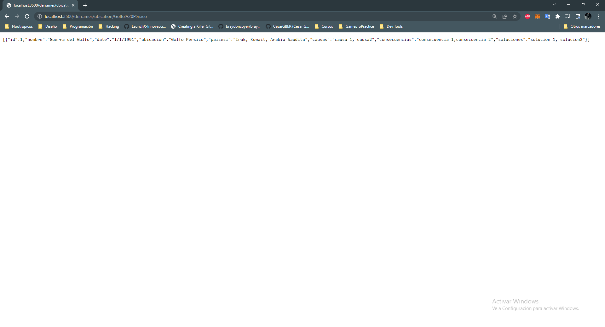
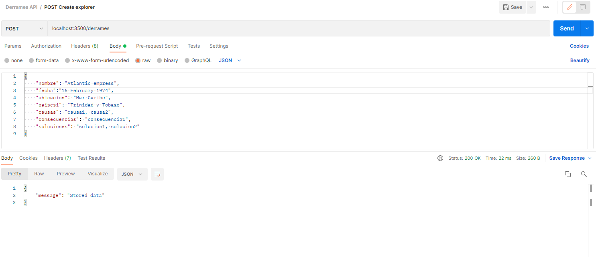
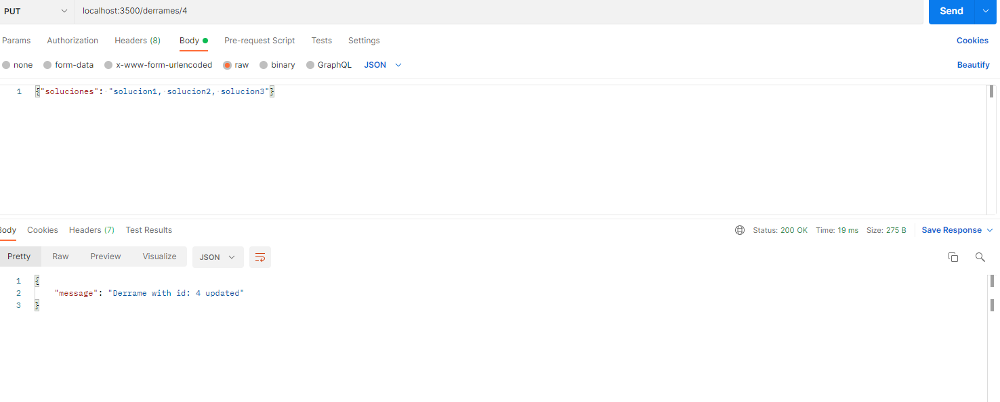

# Guardians Of The Ocean

**Hackaton: Hack The Ocean
por LaunchX 2022 - Innovaccion Virtual**

**Members:**

- Jaime Esqueda - FrontEnd, Mission Node JS, [https://github.com/JaimeEsqueda](https://github.com/JaimeEsqueda)
- Luis Angel Pasos - Backend, Mission Node JS, [https://github.com/Krocoloco](https://github.com/Krocoloco)
- Julio Cesar Garduño - Backend, Mission Node JS, [https://github.com/CesarGBkR](https://github.com/CesarGBkR)
- Ricardo Iván Jiménez Cruz - Backend, Mission Java, [https://github.com/RicardoJCruz](https://github.com/RicardoJCruz)

## Panorama

Nuestro equipo se ha percatado de que el tiempo de respuesta es muy importante al momento de contrarrestar los derrames petroleros, y que se suele perder tiempo buscando una solución viable.

Nuestra propuesta es crear una base de datos donde se puedan registrar y consultar detalles de los historiales de derrames petroleros pasados, de esta forma encontrar una solución optima encontrando las relaciones del nuevo incidente con los pasados.

También, podremos consultar las causas para prevenirlas y las consecuencias para tener una mejor visión del panorama general y saber en que aéreas priorizar prepararse para la protección y resguardo.

¡Sigue nuestro proyecto y vuélvete un Guardian!

## Objetivo

Nuestro proyecto se centra en desplegar una aplicación web que muestre información puntual acerca de derrames de petróleo ocurridos en a lo largo del tiempo en los océanos del planeta.

Los usuarios pueden consultar los detalles sobre estos eventos en una tabla que se genera a partir de consultas a una base de datos.

## Mapa de proceso

## Logros alcanzados

### Vue

Creamos el Frontend de nuestra aplicación web utilizando el framework de Vue, existen dos rutas. La ruta principal nos lleva a una página de bienvenida donde presentamos información que nos concierne sobre el tema de los derrames de petróleo en el océano.

La ruta Oil Spills es la que nos lleva a la tabla que muestra los eventos de derrame de petróleo.

### Node Js, npm, Prisma

Creamos el Backend de nuestra aplicación utilizando el framework de Node JS, gracias a npm tenemos acceso fácil a las diferentes paquetes que requerimos para correr nuestra aplicación.

Utilizamos Prisma en nuestro proyecto para mapear las estructuras de nuestra base de datos. Gracias a este ORM conectamos nuestra base de datos de mySQL con nuestro proyecto y eso nos da la posibilidad de hacer consultas, actualizar los datos, etc.

*endpoint delDerrame.png:*

*endpoint: getAll:*

*endpoint: getByCountry:*

*endpoint: getByID:*

*endpoint: getByUbication.png:*

*endpoint: postNewDerrame:*

*endpoint: putToUpdateDerrame:*

### mySQL, Docker, Azure

Utilizamos Docker para obtener una imagen de mySQL y lo corrimos como un contenedor, en el cual creamos la base de datos de nuestro proyecto.

*Imagen creada a partir de un Container:*

*Ejecucion de la imagen: (La base de datos es diferente a final)*

*Imagen en Docker Hub:*

Dicho contenedor lo pudimos convertir en una imagen personalizada, la cual subimos a Docker Hub. Los miembros de nuestro equipo ya podía hacer pull a esta imagen, sin embargo para facilitar el accesso a nuestra base de datos decidimos desplegar un contenedor de esta imagen en Azure con ACI. Una vez logrado este paso todos los miembros del equipo podían conectarse a la base de datos remotamente y sin necesidad de tener Docker instalado.

*URL de la base de datos en un ACI de Azure*

Utilizando el Cloud Shell de Azure pudimos acceder a la base de datos y correr algunas consultas y modificar el schema.

*Corriendo queries en la base de datos final*

## Tecnología usadas

Vue - Frontend de la aplicación

Node JS - Backend de la aplicación

npm - package manager

Prisma - Control de la base de datos en el Backend

Docker - Contenerización de la base de datos

mySQL - Sistema de gestión de Bases de Datos Relacionales

Azure - Despliegue de la base de datos

## Qué sigue

Como Explorers de LaunchX estamos agradecidos por ser parte de esta comunidad y de haber tenido la oportunidad de participar en este Hackaton.

Somos conscientes de las limitaciones del proyecto que presentamos y podemos identificar las áreas que podemos mejorar.

Hemos ganado mucha experiencia de realizar este proyecto, trabajando en un equipo con personas que comenzaron sin conocerse, utilizando de la manera más práctica los recursos limitados con los que contábamos y superando muchos retos. Seguiremos avanzando para lograr mejores resultados y alcanzar nuestros objetivos.

Muchas gracias.

## Recursos de información

[https://vuejs.org/guide/introduction.html](https://vuejs.org/guide/introduction.html)

[https://www.prisma.io/docs/getting-started/setup-prisma/start-from-scratch/relational-databases-node-mysql](https://www.prisma.io/docs/getting-started/setup-prisma/start-from-scratch/relational-databases-node-mysql)

[https://www.dataset.com/blog/create-docker-image/](https://www.dataset.com/blog/create-docker-image/)

[https://docs.docker.com/get-started/04_sharing_app/](https://docs.docker.com/get-started/04_sharing_app/)

[https://docs.docker.com/cloud/aci-integration/](https://docs.docker.com/cloud/aci-integration/)

[https://docs.docker.com/cloud/aci-integration/](https://docs.docker.com/cloud/aci-integration/)

[https://docs.microsoft.com/en-us/azure/container-instances/container-instances-exec](https://docs.microsoft.com/en-us/azure/container-instances/container-instances-exec)
